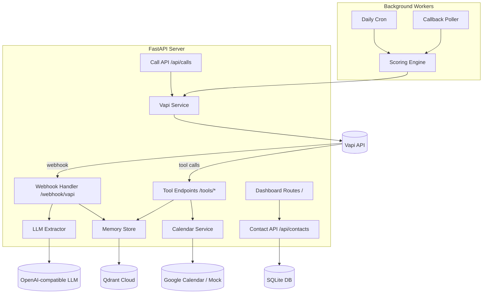
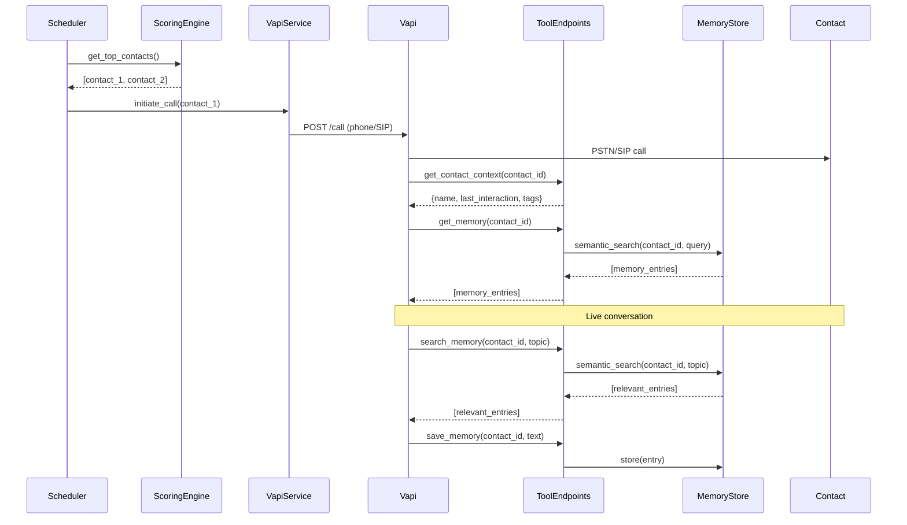
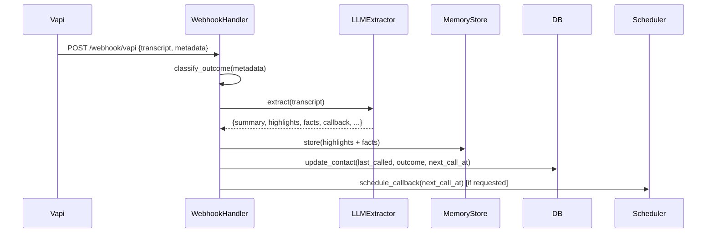

# Design Document: Contacts Catch-Up Voice Assistant

## Overview

The system is a locally-hosted Python/FastAPI application that places proactive outbound voice calls to a curated list of ~10 contacts. It combines a deterministic scoring engine, a semantic memory layer (Qdrant), and a voice API (Vapi) to hold warm, context-rich conversations. Post-call, an LLM extracts structured insights from transcripts and feeds them back into memory for future calls.

The architecture is split into three runtime concerns:

1. **HTTP Server** (FastAPI) — serves the web dashboard, exposes API endpoints, and handles Vapi tool-call webhooks during live calls.
2. **Background Workers** (APScheduler) — runs the daily scheduling cron and the short-interval callback polling loop.
3. **External Services** — Vapi (voice), Qdrant Cloud (vector memory), OpenAI-compatible LLM, and optional Google Calendar.

---

## Architecture



### Request Flow: Outbound Call



### Request Flow: Post-Call Webhook



---

## Components and Interfaces

### Scoring Engine (`services/scoring.py`)

**POC caveat on formula weights:** The `days_since_last_spoken` term is unbounded — a contact not spoken to for 30 days contributes 18.0 to the score, while `category_gap_score` and `priority_boost` are normalized to much smaller ranges. In practice the formula prioritizes longest-not-spoken contacts, with the other two terms acting as tiebreakers. This is an intentional simplification for the POC; a future improvement would cap or normalize the days term.

**`days_since_last_call` maps to `last_spoken`** — not `last_called`. A contact with 3 missed calls has a recent `last_called` but a stale `last_spoken`; the score should reflect that no conversation occurred.

**Callback override bypasses recency filter:** A contact with `next_call_at <= now` is always selected, even if they were called recently.

```python
def get_top_contacts(
    contacts: list[Contact],
    now: datetime,
    max_results: int = 2
) -> list[Contact]:
    """
    Returns up to max_results contacts eligible for a call right now.
    Applies: immediate callback override (bypasses recency filter), recency filter,
    time-window filter, category balancing, and score formula.
    NOTE: next_call_at <= now overrides recency exclusion — callback intent is explicit.
    """

def compute_score(contact: Contact, now: datetime, category_gap_scores: dict[str, float]) -> float:
    """
    score = days_since_last_spoken * 0.6 + category_gap_score * 0.3 + priority_boost * 0.1
    days_since_last_spoken is derived from contact.last_spoken (not last_called).
    """

def is_in_call_window(contact: Contact, now: datetime) -> bool:
    """
    Returns True if now (in contact's timezone) is within preferred_time_window,
    or within 09:00–20:00 if no preference is set.
    """

def compute_category_gap_scores(contacts: list[Contact]) -> dict[str, float]:
    """
    For each category tag, computes how long ago the least-recently-contacted
    member was called. Returns a normalized score per category.
    """
```

### Webhook Handler (`routes/webhook.py`)

The webhook handler **must return HTTP 200 immediately** and offload all post-processing to a background task. This prevents Vapi webhook timeouts (typically 10–30s) when a call produces many highlights/facts requiring sequential embedding calls.

```python
@router.post("/webhook/vapi")
async def vapi_webhook(payload: VapiWebhookPayload, background_tasks: BackgroundTasks):
    # Idempotency check — skip if this call_id was already processed
    if await is_call_already_processed(payload.call_id):
        return {"status": "already_processed"}
    await mark_call_as_processing(payload.call_id)
    background_tasks.add_task(process_call_webhook, payload)
    return {"status": "accepted"}
```

The `process_call_webhook` background task handles: outcome classification, LLM extraction, memory storage, contact update, and callback scheduling.

### Vapi Service (`services/vapi.py`)

A set of active call IDs is maintained in memory to prevent double-calling a contact who is already on an active call. To handle the case where a webhook is never delivered (network failure, Vapi outage), the polling loop sweeps `_active_calls` and releases any entry older than 30 minutes. `call_started_at` is also persisted to the Contact record so a server restart can detect stale active-call state.

```python
_active_calls: dict[str, datetime] = {}  # contact_id -> call_started_at

async def initiate_call(contact: Contact) -> VapiCallResponse:
    """
    Calls POST /call on the Vapi API.
    Routes to phone (PSTN) or SIP based on contact.contact_method.
    Raises AlreadyOnCallError if contact is already active.
    Raises VapiError on API failure.
    Persists call_started_at to the Contact record.
    """

def mark_call_ended(contact_id: str) -> None:
    """Called by webhook handler when a call ends to release the guard."""

def sweep_stale_active_calls(max_age_minutes: int = 30) -> None:
    """
    Called by the polling loop. Releases any contact stuck in _active_calls
    for longer than max_age_minutes (handles missed webhooks).
    """
```

### Memory Store (`services/qdrant.py`)

The Qdrant collection is initialized at application startup if it does not already exist. nomic-embed-text produces **768-dimensional** vectors; the collection uses **cosine distance**.

```python
async def ensure_collection_exists() -> None:
    """
    Called at startup. Creates the 'memories' collection with vector_size=768
    and distance=Cosine if it does not already exist. Safe to call repeatedly.
    """

async def store_memory(entry: MemoryEntry) -> str:
    """Embeds entry.text and upserts into Qdrant. Returns point ID."""

async def search_memory(contact_id: str, query: str, top_k: int = 5) -> list[MemoryEntry]:
    """
    Embeds query, performs cosine similarity search scoped to contact_id.
    Returns top_k results.
    """

async def delete_contact_memories(contact_id: str) -> None:
    """Deletes all memory entries for a given contact_id."""
```

### LLM Extractor (`services/llm.py`)

```python
async def extract_from_transcript(transcript: str) -> ExtractionResult:
    """
    Calls OpenAI-compatible API with structured output schema.
    Retries up to 2 times. Returns empty ExtractionResult on failure.
    """
```

### Embedding Service (`services/embedding.py`)

```python
async def embed(text: str) -> list[float]:
    """
    Calls nomic-embed-text via OpenAI-compatible embeddings endpoint.
    Returns a float vector.
    """
```

### Scheduler (`workers/scheduler.py`)

**Crash recovery:** One-off callback jobs are not stored in APScheduler's in-memory store — they are persisted via `next_call_at` on the Contact record in SQLite. On startup, the polling loop immediately scans for any contacts with `next_call_at <= now` and re-queues them. This means a server restart does not lose pending callbacks.

```python
def start_scheduler() -> None:
    """Starts APScheduler with daily cron and 5-min polling jobs."""

def schedule_one_off_call(contact_id: str, run_at: datetime) -> str:
    """
    Persists run_at to contact.next_call_at in SQLite (durable).
    Also adds an APScheduler one-off job for immediate scheduling if run_at is soon.
    Returns job ID.
    """
```

### Social Adapters (`services/social/`)

For the POC, all three adapters return **hardcoded fixture data** — no real API credentials or HTTP calls are made. The base class defines the interface so real implementations can be swapped in later without touching the rest of the system.

```python
class SocialAdapterBase(ABC):
    @abstractmethod
    async def fetch_updates(self, contact: Contact) -> list[SocialUpdate]: ...

class TwitterAdapter(SocialAdapterBase):
    """POC: returns fixture tweets. Real X API integration is future work."""
    async def fetch_updates(self, contact: Contact) -> list[SocialUpdate]:
        return TWITTER_FIXTURES.get(contact.contact_id, [])

class InstagramAdapter(SocialAdapterBase):
    """POC: returns fixture posts. Real Instagram Graph API is future work."""
    async def fetch_updates(self, contact: Contact) -> list[SocialUpdate]:
        return INSTAGRAM_FIXTURES.get(contact.contact_id, [])

class LinkedInAdapter(SocialAdapterBase):
    """POC: returns fixture activity. Real LinkedIn API is future work."""
    async def fetch_updates(self, contact: Contact) -> list[SocialUpdate]:
        return LINKEDIN_FIXTURES.get(contact.contact_id, [])
```

Fixture data lives in `services/social/fixtures.py`. Fixtures are keyed by **contact name** (lowercased), not by UUID, so freshly created contacts match fixtures by name. If no name match is found, a **default fixture set** is returned (a generic set of plausible social updates) so the assistant always has some social context to reference.

```python
def get_fixture_updates(contact: Contact, platform: str) -> list[SocialUpdate]:
    key = contact.name.lower()
    return FIXTURES[platform].get(key, FIXTURES[platform]["__default__"])
```

### Calendar Service (`services/calendar.py`)

```python
async def get_free_slots(days_ahead: int = 7) -> list[TimeSlot]:
    """Returns mock slots (or real Google Calendar slots if configured)."""

async def create_event(start: datetime, end: datetime, contact: Contact) -> CalendarEvent:
    """Creates event (mock or real). Returns confirmation."""
```

---

## Data Models

### Contact (`models/contact.py`)

```python
from pydantic import BaseModel, Field
from typing import Optional, Literal
from datetime import datetime

class TimeWindow(BaseModel):
    start: str  # "HH:MM"
    end: str    # "HH:MM"

class SocialHandles(BaseModel):
    twitter: Optional[str] = None
    instagram: Optional[str] = None
    linkedin: Optional[str] = None

class Contact(BaseModel):
    contact_id: str = Field(default_factory=lambda: str(uuid4()))
    name: str
    phone: str                          # E.164 format
    sip: Optional[str] = None
    contact_method: Literal["phone", "sip"] = "phone"
    tags: list[str] = []
    timezone: str                       # IANA timezone string
    last_called: Optional[datetime] = None
    last_spoken: Optional[datetime] = None
    call_time_preference: Literal["morning", "evening", "specific_time", "none"] = "none"
    preferred_time_window: Optional[TimeWindow] = None
    next_call_at: Optional[datetime] = None
    priority_boost: float = 0.0
    last_call_outcome: Optional[Literal["answered", "busy", "no_answer"]] = None
    last_call_note: Optional[str] = None
    call_started_at: Optional[datetime] = None  # set when call is initiated; cleared on webhook receipt
    social_handles: SocialHandles = Field(default_factory=SocialHandles)
```

### Memory Entry (`models/memory.py`)

```python
class MemoryEntry(BaseModel):
    entry_id: str = Field(default_factory=lambda: str(uuid4()))
    contact_id: str
    type: Literal["summary", "highlight", "fact", "social"]
    text: str
    timestamp: datetime = Field(default_factory=lambda: datetime.now(UTC))  # UTC-aware; avoids deprecated utcnow()
```

### Extraction Result (`models/memory.py`)

```python
class CallbackIntent(BaseModel):
    type: Literal["relative", "absolute", "none"]
    value: str = ""

class ExtractionResult(BaseModel):
    summary: str = ""
    highlights: list[str] = []
    facts: list[dict] = []
    followups: list[str] = []
    callback: CallbackIntent = Field(default_factory=lambda: CallbackIntent(type="none"))
    call_time_preference: Literal["morning", "evening", "specific_time", "none"] = "none"
```

### SQLite Schema

> **Note on JSON columns:** `tags`, `preferred_time_window`, and `social_handles` are stored as raw JSON strings. Malformed values inserted directly via a DB tool will cause parse errors on read. For the POC this is acceptable; a future improvement would add a CHECK constraint or a read-time validation layer.

```sql
CREATE TABLE contacts (
    contact_id   TEXT PRIMARY KEY,
    name         TEXT NOT NULL,
    phone        TEXT NOT NULL,
    sip          TEXT,
    contact_method TEXT NOT NULL DEFAULT 'phone',
    tags         TEXT,           -- JSON array
    timezone     TEXT NOT NULL,
    last_called  TEXT,           -- ISO timestamp
    last_spoken  TEXT,
    call_time_preference TEXT DEFAULT 'none',
    preferred_time_window TEXT,  -- JSON object
    next_call_at TEXT,
    priority_boost REAL DEFAULT 0.0,
    last_call_outcome TEXT,
    last_call_note TEXT,
    call_started_at TEXT,        -- ISO timestamp; set on call initiation, cleared on webhook
    social_handles TEXT          -- JSON object
);
```

---

## Correctness Properties

A property is a characteristic or behavior that should hold true across all valid executions of a system — essentially, a formal statement about what the system should do. Properties serve as the bridge between human-readable specifications and machine-verifiable correctness guarantees.


### Property 1: Scoring formula is exact
*For any* contact with known `days_since_last_spoken` (derived from `last_spoken`), `category_gap_score`, and `priority_boost`, the value returned by `compute_score` shall equal `days_since_last_spoken * 0.6 + category_gap_score * 0.3 + priority_boost * 0.1` exactly.
**Validates: Requirements 2.1**

### Property 2: Immediate callback always wins (overrides recency filter)
*For any* set of contacts where at least one has `next_call_at <= now`, that contact shall appear first in the result of `get_top_contacts`, regardless of the formula scores of other contacts **and regardless of whether that contact was recently called** (the callback intent overrides the recency exclusion).
**Validates: Requirements 2.2**

### Property 3: Recency filter excludes recently-called contacts (unless callback override applies)
*For any* contact whose `last_called` timestamp is within the configured recency window relative to `now` **and whose `next_call_at` is either absent or in the future**, that contact shall never appear in the output of `get_top_contacts`.
**Validates: Requirements 2.3**

### Property 4: Category gap score ordering
*For any* set of contacts spanning multiple category tags, the category whose least-recently-contacted member was called longest ago shall receive the highest `category_gap_score`.
**Validates: Requirements 2.4**

### Property 5: Time window filter (including default window)
*For any* contact and any `now` value where the contact's local time falls outside their `preferred_time_window` (or outside 09:00–20:00 if no preference is set), `is_in_call_window` shall return `False` and the contact shall not appear in `get_top_contacts` output.
**Validates: Requirements 2.5, 2.6**

### Property 6: Result set size bounded
*For any* input contact list and `now`, `get_top_contacts` shall return a list of length between 0 and 2 (inclusive).
**Validates: Requirements 2.7**

### Property 7: Contact creation round-trip
*For any* valid contact payload submitted to `POST /api/contacts`, retrieving that contact via `GET /api/contacts/{contact_id}` shall return a record whose fields match the submitted payload.
**Validates: Requirements 1.2**

### Property 8: Invalid phone number rejected
*For any* string that does not conform to E.164 format (i.e., does not match `^\+[1-9]\d{6,14}$`), submitting it as the `phone` field shall result in a 422 validation error response.
**Validates: Requirements 1.4**

### Property 9: Missing required field rejected
*For any* contact payload missing at least one of `name`, `phone`, or `timezone`, submitting it to `POST /api/contacts` shall result in a 422 validation error response.
**Validates: Requirements 1.3**

### Property 10: Contact deletion removes all associated data
*For any* contact that has been created and has associated memory entries, after `DELETE /api/contacts/{contact_id}`, both the contact record and all memory entries for that `contact_id` shall be absent from the database and Memory_Store.
**Validates: Requirements 1.6**

### Property 11: Outbound call uses correct contact method
*For any* contact with `contact_method = "phone"`, the Vapi API call payload shall use the PSTN phone number; for any contact with `contact_method = "sip"`, the payload shall use the SIP address.
**Validates: Requirements 4.1**

### Property 12: Webhook outcome classification always produces a valid value
*For any* Vapi webhook payload, the outcome classifier shall return exactly one of `"answered"`, `"busy"`, or `"no_answer"` — never `None` or an unrecognized string.
**Validates: Requirements 5.2**

### Property 13: LLM extraction result conforms to schema
*For any* non-empty transcript string, the result of `extract_from_transcript` shall be a valid `ExtractionResult` instance (all required fields present, correct types, `callback.type` in `{relative, absolute, none}`).
**Validates: Requirements 5.3**

### Property 14: Highlights and facts count matches stored memory entries
*For any* `ExtractionResult` with `len(highlights) = N` and `len(facts) = M`, the webhook handler shall store exactly `N + M` new memory entries in the Memory_Store for that contact.
**Validates: Requirements 5.6**

### Property 15: Contact fields updated after webhook processing
*For any* successfully processed webhook, the contact record's `last_called`, `last_call_outcome`, and `last_call_note` shall reflect the values derived from the webhook payload and extraction result.
**Validates: Requirements 5.7**

### Property 16: Memory store round-trip with embedding
*For any* `MemoryEntry`, after calling `store_memory(entry)`, calling `search_memory(entry.contact_id, entry.text, top_k=1)` shall return a result list whose first element has the same `text` and `contact_id` as the original entry, and the stored vector shall be a non-empty float list.
**Validates: Requirements 6.1, 6.2**

### Property 17: Memory search is scoped to contact_id — no cross-contact leakage
*For any* `contact_id` and query string, every entry returned by `search_memory(contact_id, query)` shall have `entry.contact_id == contact_id`. No entries belonging to other contacts shall appear in the results.
**Validates: Requirements 6.4, 4.5**

### Property 18: Search result count bounded by top_k
*For any* `contact_id`, query, and `top_k` value, the length of the list returned by `search_memory` shall be less than or equal to `top_k`.
**Validates: Requirements 6.3**

### Property 19: Social updates stored with type "social"
*For any* social update returned by a `SocialAdapter.fetch_updates()` call (including fixture data), the corresponding memory entry stored in the Memory_Store shall have `type == "social"`.
**Validates: Requirements 7.2**

### Property 20: Missing required environment variable causes startup failure
*For any* required environment variable (from the defined set), if that variable is absent from the environment, the application startup shall raise a descriptive `ConfigurationError` and not proceed to serve requests.
**Validates: Requirements 10.2**

---

## Error Handling

| Scenario | Handling |
|---|---|
| Vapi API error on call initiation | Log error, set `last_call_outcome = no_answer`, schedule retry on next polling cycle |
| Contact already on active call | Raise `AlreadyOnCallError`, skip initiation, log warning |
| Active call stuck > 30 min (missed webhook) | `sweep_stale_active_calls()` in polling loop releases the guard automatically |
| Duplicate webhook delivery (same `call_id`) | Return `{"status": "already_processed"}` immediately; skip all processing |
| LLM extraction failure (up to 2 retries) | Return empty `ExtractionResult`, log warning, continue webhook processing |
| Qdrant unavailable during memory store | Log error, raise `MemoryStoreError`, webhook returns 500 (Vapi will retry) |
| Qdrant unavailable during tool call | Return empty list to Vapi assistant, log error |
| Qdrant collection missing at startup | Auto-create collection with vector_size=768, cosine distance |
| Invalid webhook payload | Return 400, log payload for debugging |
| Missing env var at startup | Raise `ConfigurationError` with variable name, exit with non-zero code |
| Contact not found during tool call | Return 404 JSON response to Vapi |
| Scheduler job failure | Log exception, do not crash scheduler; retry on next cycle |
| Social adapter fetch failure | Log warning, skip that adapter, continue with other adapters |

---

## Testing Strategy

### Dual Testing Approach

Both unit tests and property-based tests are required and complementary:

- **Unit tests** cover specific examples, integration points, edge cases, and error conditions.
- **Property-based tests** verify universal correctness properties across randomly generated inputs.

### Property-Based Testing

Library: **[Hypothesis](https://hypothesis.readthedocs.io/)** (Python)

Each property from the Correctness Properties section above shall be implemented as a single Hypothesis test. Configuration:

- Minimum **100 iterations** per property test (`settings(max_examples=100)`)
- Each test tagged with a comment: `# Feature: contacts-catch-up-voice-assistant, Property N: <property_text>`
- Strategies: use `hypothesis.strategies` to generate `Contact`, `MemoryEntry`, `ExtractionResult`, and primitive types

### Unit Testing

Framework: **pytest**

Focus areas:
- Specific scoring examples (known inputs → known outputs)
- Webhook payload parsing with real Vapi payload shapes
- LLM retry logic with mocked HTTP client (2 failures → empty result)
- Calendar stub returns correct mock shapes
- Social adapter mock mode
- Dashboard route HTTP responses (status codes, required HTML fields)
- Scheduler one-off job creation

### Test Organization

```
tests/
  unit/
    test_scoring.py         # Properties 1–6 + unit examples
    test_contacts_api.py    # Properties 7–10
    test_vapi_service.py    # Property 11
    test_webhook.py         # Properties 12–15
    test_memory.py          # Properties 16–18
    test_social.py          # Property 19 — fixture adapters store type=social
    test_config.py          # Property 20
    test_scheduler.py       # Scheduler examples
    test_calendar.py        # Calendar stub examples
  integration/
    test_call_flow.py       # Stretch goal: end-to-end call trigger → webhook, Vapi mocked via respx at httpx boundary
```
